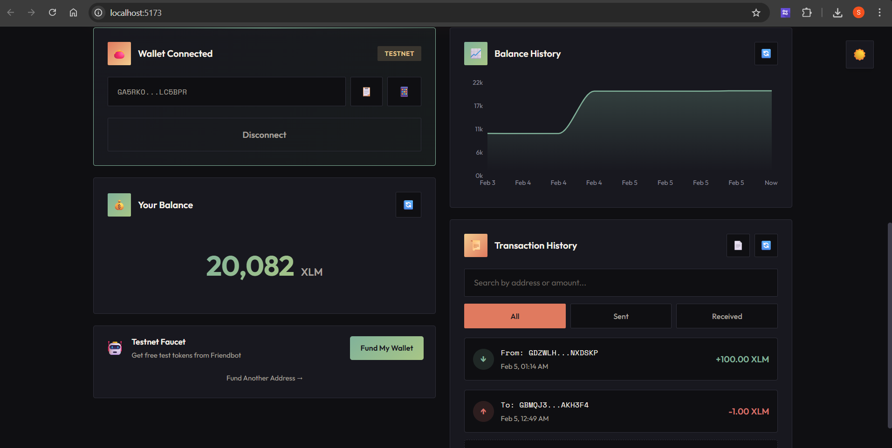
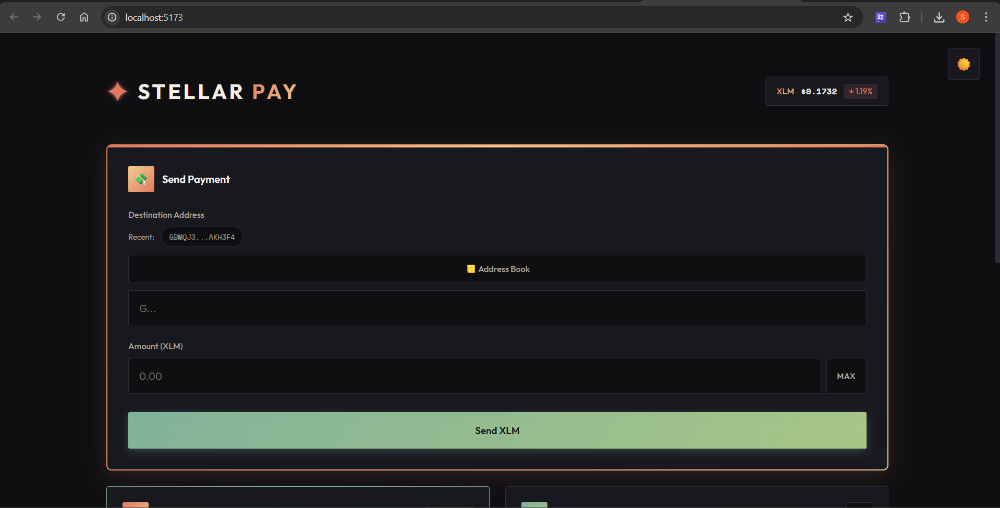
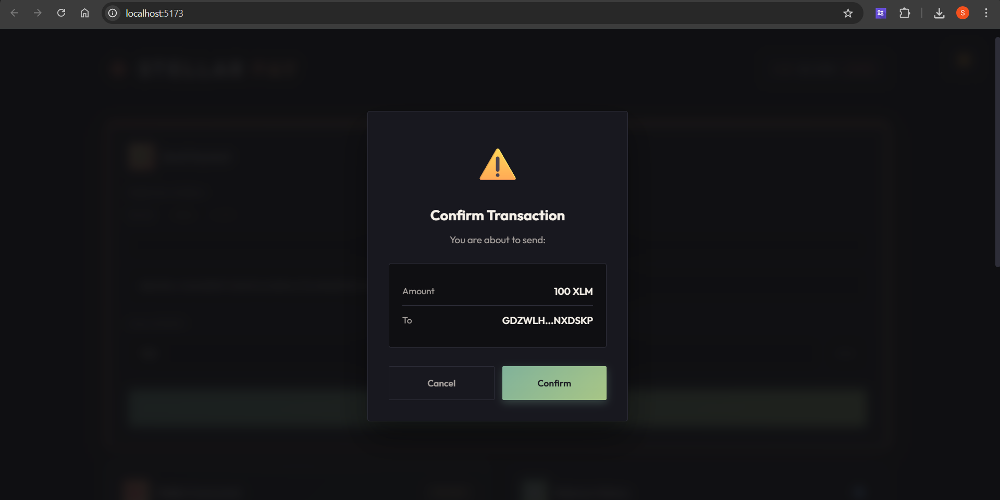
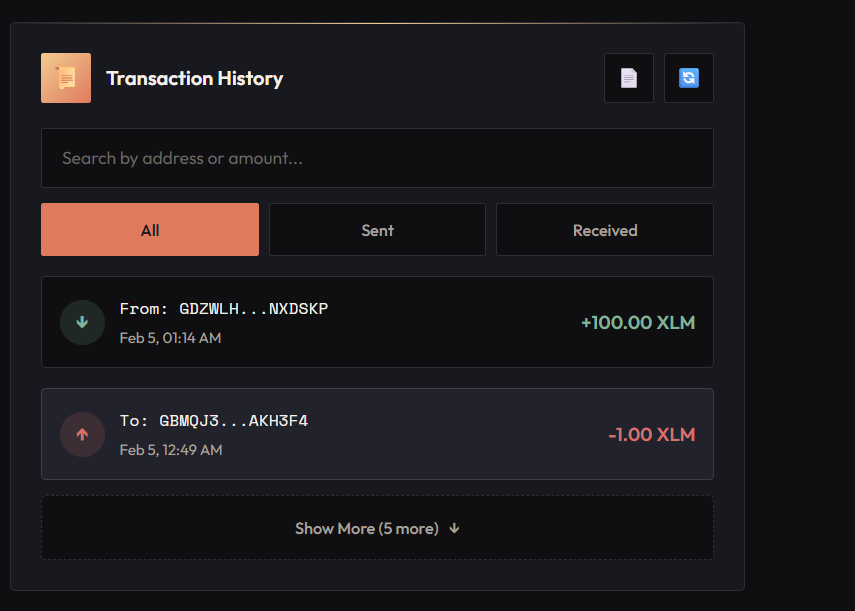

# 🚀 Stellar Pay

A modern, feature-rich web application for sending and receiving payments on the Stellar blockchain testnet. Built with React, TypeScript, and the Freighter wallet integration.



## ✨ Features

### Core Features
- **🔗 Wallet Integration** - Seamless connection with Freighter wallet
- **💸 Send Payments** - Send XLM to any Stellar address with confirmation
- **💰 Balance Display** - Real-time balance updates from the blockchain
- **📊 Balance Chart** - Visual history of your balance over time
- **📜 Transaction History** - Searchable, filterable transaction list with PDF export

### Bonus Features
- **🤖 Testnet Faucet** - One-click funding from Friendbot + fund any address
- **📒 Address Book** - Save frequent recipients with nicknames
- **👥 Recent Recipients** - Quick access to recently used addresses
- **📱 QR Code** - Generate QR codes for receiving payments
- **🧾 Transaction Receipt** - Professional PDF receipts with share functionality
- **🌓 Dark/Light Mode** - Toggle between themes
- **🔄 Auto-Reconnect** - Wallet stays connected across page refreshes
- **✨ Smooth Animations** - GSAP-powered animations with Lenis smooth scroll

## 📸 Screenshots

### Send Payment Interface
The main dashboard with the Send Payment form, Address Book, and recent recipients.



### Wallet Connected & Dashboard
Full dashboard showing wallet connection, balance (20,082 XLM), balance chart, transaction history, and testnet faucet.


### Transaction Confirmation
Confirmation modal before sending a payment, showing amount and recipient address.



### Transaction History
Complete transaction history with search, filter tabs, and "Show More" pagination.



## 🛠️ Tech Stack

| Technology | Purpose |
|------------|---------|
| **React 19** | UI Framework |
| **TypeScript** | Type Safety |
| **Vite** | Build Tool |
| **Stellar SDK** | Blockchain Integration |
| **Freighter API** | Wallet Connection |
| **GSAP** | Animations |
| **Lenis** | Smooth Scrolling |
| **Recharts** | Balance Charts |
| **jsPDF** | PDF Generation |

## 🚀 Getting Started

### Prerequisites

- **Node.js** v18+ installed
- **Freighter Wallet** browser extension ([Install here](https://freighter.app))
- Freighter configured to use **Testnet**

### Installation

1. **Clone the repository**
   ```bash
   git clone https://github.com/SATISH-JALAN/Stellar-pay.git
   cd Stellar-pay
   ```

2. **Install dependencies**
   ```bash
   npm install
   ```

3. **Start the development server**
   ```bash
   npm run dev
   ```

4. **Open your browser**
   ```
   http://localhost:5173
   ```

### Build for Production

```bash
npm run build
npm run preview
```

## 📖 Usage Guide

### 1. Connect Your Wallet
- Click "Connect Wallet" button
- Approve the connection in Freighter popup
- Your wallet address and balance will appear

### 2. Fund Your Account (Testnet)
- Click "Fund My Wallet" to get 10,000 free testnet XLM
- Or toggle "Fund Another Address" to fund any testnet account

### 3. Send a Payment
1. Enter the recipient's Stellar address
2. Enter the amount in XLM
3. Optionally add a memo
4. Click "Send Payment"
5. Confirm in Freighter
6. View your transaction receipt

### 4. View Transaction History
- See all your sent and received transactions
- Use search to find specific transactions
- Filter by type (All/Sent/Received)
- Export to PDF for records

## 🏗️ Project Structure

```
src/
├── components/          # React components
│   ├── AddressBook.tsx     # Save frequent addresses
│   ├── BalanceChart.tsx    # Historical balance chart
│   ├── BalanceDisplay.tsx  # Current balance display
│   ├── FriendbotFund.tsx   # Testnet faucet
│   ├── Logo.tsx            # Animated logo
│   ├── PriceDisplay.tsx    # XLM price ticker
│   ├── QRCode.tsx          # QR code generator
│   ├── RecentRecipients.tsx # Recent addresses
│   ├── SendPayment.tsx     # Payment form
│   ├── ThemeToggle.tsx     # Dark/light mode
│   ├── TransactionHistory.tsx # Tx list
│   ├── TransactionReceipt.tsx # PDF receipt
│   ├── TransactionStatus.tsx  # Status modal
│   └── WalletConnect.tsx   # Wallet connection
├── hooks/
│   └── useWallet.ts        # Wallet state management
├── utils/
│   └── stellar.ts          # Stellar SDK helpers
├── App.tsx                 # Main application
├── App.css                 # Global styles
└── main.tsx               # Entry point
```

## 🔐 Security Notes

- This app is configured for **Stellar Testnet** only
- Never use real funds or mainnet keys with this demo
- All transactions are signed locally via Freighter
- No private keys are ever exposed to the application

## 🌐 Network Configuration

The app is configured to use:
- **Horizon Server**: `https://horizon-testnet.stellar.org`
- **Network Passphrase**: `Test SDF Network ; September 2015`

## 📄 License

MIT License - feel free to use this project for learning and development.

## 🙏 Acknowledgments

- [Stellar Development Foundation](https://stellar.org) - For the amazing blockchain
- [Freighter Wallet](https://freighter.app) - For seamless wallet integration
- [Horizon API](https://developers.stellar.org/api) - For blockchain data access

---

<p align="center">
  Built with ❤️ for the Stellar ecosystem
</p>
