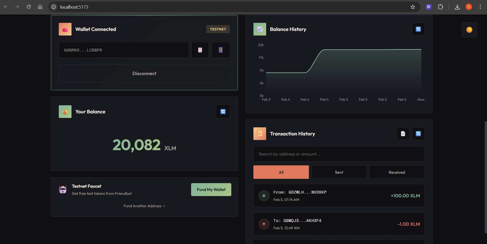
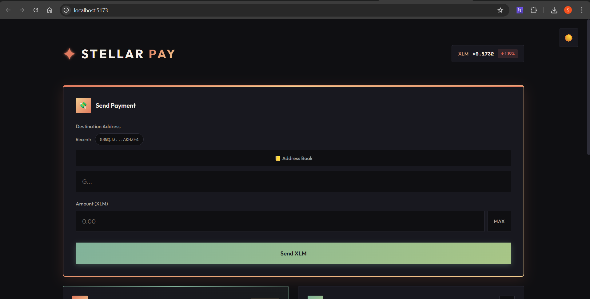
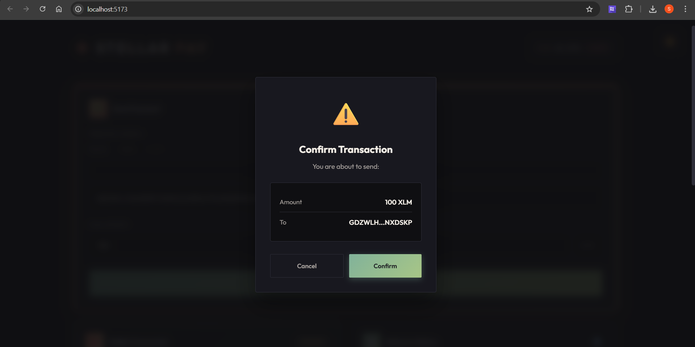
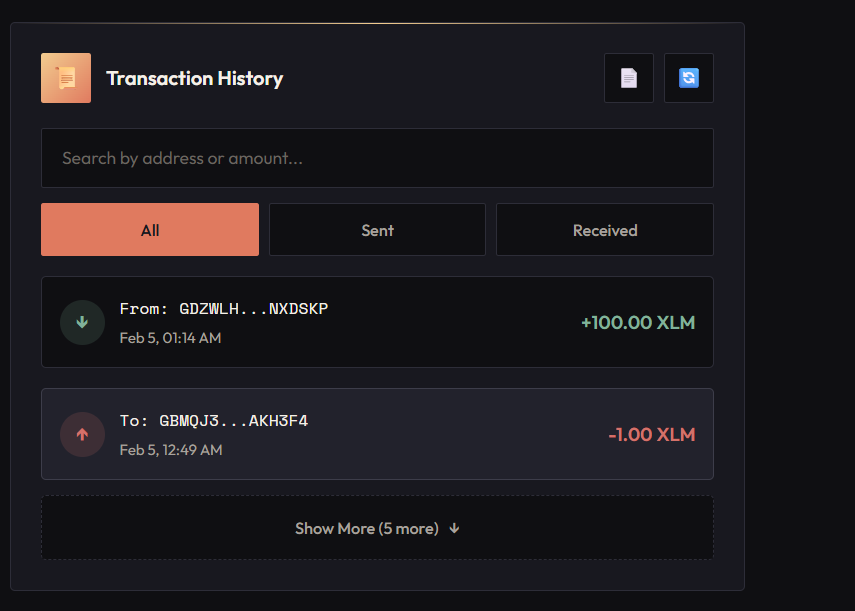

# 🚀 Stellar Pay

A modern, feature-rich web application for sending and receiving payments on the Stellar blockchain testnet. Built with React, TypeScript, and multi-wallet integration using StellarWalletsKit.



## 🟠 Orange Belt Submission (Level 3)

This project fulfills all requirements for the Stellar Quest Orange Belt Level 3:

### ✅ Requirements Met

- **Mini-dApp Fully Functional** - Complete payment app with smart contract integration
- **Minimum 3 Tests Passing** - 21 tests across 3 test suites (all passing)
- **README Complete** - Full documentation with setup, usage, and contract details
- **Loading States & Progress Indicators** - Top-of-page progress bar + spinners throughout
- **Basic Caching** - In-memory TTL cache for balance and API calls
- **3+ Meaningful Commits** - 15+ commits with feature implementations

### 🧪 Tests

Run the test suite:

```bash
cd client
npm test
```

| File                   | Tests | Coverage                                 |
| ---------------------- | ----- | ---------------------------------------- |
| `stellar.test.ts`      | 6     | `isValidPublicKey`, `formatPublicKey`    |
| `errorDisplay.test.ts` | 8     | `detectErrorType` - all 3 error types    |
| `cache.test.ts`        | 7     | TTL cache - set, get, expire, invalidate |

### ⚡ Caching

In-memory TTL cache reduces redundant API calls:

| Data                | TTL | Cache Key                  |
| ------------------- | --- | -------------------------- |
| Account Balance     | 15s | `balance:<publicKey>`      |
| Transaction History | 30s | `transactions:<publicKey>` |
| XLM Price           | 60s | `price:XLM`                |
| Contract Stats      | 30s | `contract:count`           |

Cache is automatically invalidated after a successful payment.

### 🔄 Loading States

- Top-of-page animated progress bar during payment submission
- Spinner in balance display while fetching
- Disabled buttons with "Sending..." / "Connecting..." labels
- Transaction status modal: pending → success / error

---

## 🟡 Yellow Belt Submission (Level 2)

This project fulfills all requirements for the Stellar Quest Yellow Belt Level 2:

### ✅ Requirements Met

- **Multi-Wallet Integration** - StellarWalletsKit with 4 wallet options (Freighter, xBull, LOBSTR, Albedo)
- **3 Error Types Handled** - Wallet not found, user rejected, insufficient balance
- **Smart Contract Deployed** - Payment Registry contract on Stellar testnet
- **Contract Called from Frontend** - Real-time payment logging and statistics
- **Transaction Status Tracking** - Pending/Success/Error states with visual feedback
- **2+ Meaningful Commits** - 15+ commits with feature implementations

### 📜 Deployed Smart Contract

**Contract ID:** `CAIORM4STQRH5V7N6IGHGTEGWG2QNIK7GIZ5GL6WLMNEH73PHJY4YPSC`

**Deploy Transaction:** `c85528509f0934f0711d288146df4e776c4bd5df582d352fd5a52d39fc8dabf3`

**View on Stellar Expert:**

- [Contract Details](https://stellar.expert/explorer/testnet/contract/CAIORM4STQRH5V7N6IGHGTEGWG2QNIK7GIZ5GL6WLMNEH73PHJY4YPSC)
- [Deploy Transaction](https://stellar.expert/explorer/testnet/tx/c85528509f0934f0711d288146df4e776c4bd5df582d352fd5a52d39fc8dabf3)

**Contract Functions:**

- `log_payment` - Records payment transactions on-chain
- `get_payment_count` - Returns total logged payments
- `get_payment` - Retrieves specific payment details
- `get_recent_payments` - Fetches recent payment history

### 👛 Supported Wallets

| Wallet        | Icon | Description                 |
| ------------- | ---- | --------------------------- |
| **Freighter** | 🦊   | Most popular Stellar wallet |
| **xBull**     | 🐂   | Feature-rich wallet         |
| **LOBSTR**    | 🦞   | Mobile-friendly wallet      |
| **Albedo**    | 🌟   | Web-based wallet            |


### 🚨 Error Handling

Three distinct error types with custom UI:

1. **Wallet Not Found** 🔌 - Detects when wallet extension is missing
2. **User Rejected** 🚫 - Handles transaction cancellations gracefully
3. **Insufficient Balance** 💸 - Validates account balance before transactions

### 📊 Transaction Status Tracking

- **Pending** - Shows spinner while awaiting wallet signature
- **Success** - Displays transaction hash with Stellar Expert link
- **Error** - Shows detailed error message

---

## ✨ Features

### Core Features

- **🔗 Wallet Integration** - Seamless connection with Freighter wallet
- **💸 Send Payments** - Send XLM to any Stellar address with confirmation
- **💰 Balance Display** - Real-time balance updates from the blockchain
- **📊 Balance Chart** - Visual history of your balance over time
- **📜 Transaction History** - Searchable, filterable transaction list with PDF export

### Bonus Features

- **🤖 Testnet Faucet** - One-click funding from Friendbot + fund any address
- **📒 Address Book** - Save frequent recipients with nicknames
- **👥 Recent Recipients** - Quick access to recently used addresses
- **📱 QR Code** - Generate QR codes for receiving payments
- **🧾 Transaction Receipt** - Professional PDF receipts with share functionality
- **🌓 Dark/Light Mode** - Toggle between themes
- **🔄 Auto-Reconnect** - Wallet stays connected across page refreshes
- **✨ Smooth Animations** - GSAP-powered animations with Lenis smooth scroll

## 📸 Screenshots

### Multi-Wallet Selection

Choose from 4 different Stellar wallets with StellarWalletsKit integration.


### Send Payment Interface

The main dashboard with the Send Payment form, Address Book, and recent recipients.



### Wallet Connected & Dashboard

Full dashboard showing wallet connection, balance (20,082 XLM), balance chart, transaction history, and testnet faucet.


### Transaction Confirmation

Confirmation modal before sending a payment, showing amount and recipient address.



### Transaction History

Complete transaction history with search, filter tabs, and "Show More" pagination.



## 🛠️ Tech Stack

| Technology            | Purpose                 |
| --------------------- | ----------------------- |
| **React 19**          | UI Framework            |
| **TypeScript**        | Type Safety             |
| **Vite**              | Build Tool              |
| **Stellar SDK**       | Blockchain Integration  |
| **StellarWalletsKit** | Multi-Wallet Support    |
| **Soroban**           | Smart Contract Platform |
| **GSAP**              | Animations              |
| **Lenis**             | Smooth Scrolling        |
| **Recharts**          | Balance Charts          |
| **jsPDF**             | PDF Generation          |

## 🚀 Getting Started

### Prerequisites

- **Node.js** v18+ installed
- **Freighter Wallet** browser extension ([Install here](https://freighter.app))
- Freighter configured to use **Testnet**

### Installation

1. **Clone the repository**

   ```bash
   git clone https://github.com/SATISH-JALAN/Stellar-pay.git
   cd Stellar-pay
   ```

2. **Install dependencies**

   ```bash
   cd client
   npm install
   ```

3. **Start the development server**

   ```bash
   npm run dev
   ```

4. **Open your browser**
   ```
   http://localhost:5173
   ```

### Build for Production

```bash
npm run build
npm run preview
```

## 📖 Usage Guide

### 1. Connect Your Wallet

- Click "Select Wallet" button
- Choose from Freighter, xBull, LOBSTR, or Albedo
- Approve the connection in your wallet
- Your wallet address and balance will appear

### 2. Fund Your Account (Testnet)

- Click "Fund My Wallet" to get 10,000 free testnet XLM
- Or toggle "Fund Another Address" to fund any testnet account

### 3. Send a Payment

1. Enter the recipient's Stellar address
2. Enter the amount in XLM
3. Optionally add a memo
4. Click "Send Payment"
5. Confirm in your wallet
6. Transaction is logged to the smart contract
7. View your transaction receipt

### 4. View Transaction History

- See all your sent and received transactions
- Use search to find specific transactions
- Filter by type (All/Sent/Received)
- Export to PDF for records

### 5. Monitor Contract Stats

- View total payments logged on-chain
- See contract ID and deployment transaction
- Real-time updates every 30 seconds
- Click links to view on Stellar Expert

## 🏗️ Project Structure

```
├── client/                  # React frontend
│   └── src/
│       ├── components/      # UI components
│       ├── hooks/           # useWallet hook
│       ├── utils/
│       │   ├── soroban.ts   # Smart contract interactions
│       │   ├── stellar.ts   # Stellar SDK helpers
│       │   ├── walletKit.ts # StellarWalletsKit setup
│       │   └── cache.ts     # In-memory TTL cache
│       └── test/            # Vitest test suites
├── contract/                # Soroban smart contract (Rust)
│   ├── src/lib.rs           # Contract source code
│   ├── Cargo.toml           # Rust dependencies
│   └── README.md            # Build & deploy instructions
└── server/                  # Express API server
```

## 🔐 Security Notes

- This app is configured for **Stellar Testnet** only
- Never use real funds or mainnet keys with this demo
- All transactions are signed locally via Freighter
- No private keys are ever exposed to the application

## 🌐 Network Configuration

The app is configured to use:

- **Horizon Server**: `https://horizon-testnet.stellar.org`
- **Soroban RPC**: `https://soroban-testnet.stellar.org`
- **Network Passphrase**: `Test SDF Network ; September 2015`

## 🧪 Testing the Smart Contract

You can verify the contract deployment and interactions:

1. **View Contract on Stellar Expert:**
   - [Contract Details](https://stellar.expert/explorer/testnet/contract/CAIORM4STQRH5V7N6IGHGTEGWG2QNIK7GIZ5GL6WLMNEH73PHJY4YPSC)

2. **View Deploy Transaction:**
   - [Deploy TX](https://stellar.expert/explorer/testnet/tx/c85528509f0934f0711d288146df4e776c4bd5df582d352fd5a52d39fc8dabf3)

3. **Test Contract Functions:**
   - Connect your wallet in the app
   - Send a payment to log it on-chain
   - View the payment count increase in the Contract Stats card
   - Check transaction status in real-time

## 📄 License

MIT License - feel free to use this project for learning and development.

## 🙏 Acknowledgments

- [Stellar Development Foundation](https://stellar.org) - For the amazing blockchain
- [Freighter Wallet](https://freighter.app) - For seamless wallet integration
- [Horizon API](https://developers.stellar.org/api) - For blockchain data access

---

<p align="center">
  Built with ❤️ for the Stellar ecosystem
</p>
